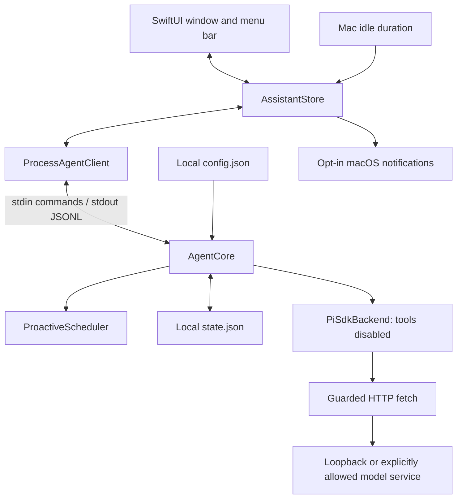

# Architecture

**English** | [简体中文](architecture.zh-CN.md)

Another You separates native presentation, proactive state, and model requests. This keeps user decisions visible and gives model access a narrow boundary. The current preview supports one local user and one active model request per sidecar.

## Data flow

[AgentClient.swift](../macos/AnotherYou/Sources/AnotherYouCore/AgentClient.swift) owns process launch, JSONL framing, decoding, and shutdown. [AssistantStore.swift](../macos/AnotherYou/Sources/AnotherYouCore/AssistantStore.swift) updates cards and activity from real events, correlates prompt responses, and supplies idle measurements. It does not treat a sent command as a completed action.

[AgentCore](../agent-core/src/index.ts) owns proposal transitions and persisted history. [ProactiveScheduler](../agent-core/src/scheduler.ts) matches time, event, and idle rules and applies cooldown/deduplication. [PiSdkBackend](../agent-core/src/pi-adapter.ts) validates the endpoint and calls the configured model.

## Why suggestions do not require a model

Proactive participation currently comes from explainable rules. App launch, a local-time match, or a measured idle threshold can create a pending suggestion without a model request. The text explains the available signal; it does not infer unseen calendar entries, contacts, screen contents, or work activity.

A rule cannot create another suggestion while its previous proposal is pending, running, snoozed, or failed. Cooldowns and hashed deduplication keys further limit repetition. Snoozed suggestions keep their identity when they return. Pause and proposal state survive restarts; an interrupted generation returns as failed and needs a new user decision.

Choosing to generate a draft sends the proposal's title, summary, and explicit context to the model. Direct questions send the submitted prompt. Each request starts a new Pi session without automatic conversation memory. Completed text is for review: it does not send a message, modify a file, or execute a command.

The app and sidecar must be running for signals to be processed. Time rules match the current local minute; missed time slots are not replayed. Snoozed proposals are restored on the next eligible tick after their due time. See the [CLI reference](cli-reference.md) for states and rules.

## Runtime and data boundaries

| Boundary | Current implementation |
| --- | --- |
| Model network | `local` uses loopback only. Non-loopback requests require an authorized privacy mode, network opt-in, exact allowed hostname, and HTTPS. Each fetch rejects redirects and leaving the configured origin. |
| Model tools | Pi receives an empty tool list; attempted tool calls are blocked. User Pi configuration, extensions, skills, and default provider credentials are not loaded. |
| Model credentials | The explicit `apiKeyEnv` name points to the sidecar process environment. The Swift settings screen has no remote-key input or Keychain integration. |
| Persisted content | Storage switches and basic credential redaction apply when saving state. They do not filter live model input/output or encrypt files. |
| Native notifications | `AssistantStore` uses a separate UserDefaults preference and macOS authorization. The app must be bundled, inactive, and unpaused when a new suggestion arrives. `tools.notifications` is not this switch. |
| Process isolation | Swift and Node communicate through pipes; these processes are not an operating-system sandbox for untrusted code. |
| Development traffic | npm installs and Git source fetches operate separately from the model network policy. |

Configuration and state use local file permissions. History is bounded, but unresolved suggestions are retained. Errors from malformed state are reported rather than silently resetting it. Exact defaults, file locations, retention, and the limits of redaction are in [configuration](configuration.md).

## Development and packaging

Source runs resolve an explicit Agent path or nearby development checkout; app bundles carry the sidecar in their resources. Node can come from an explicit path, the bundle, or the machine. The package script can copy a self-contained official Node binary; a dynamically linked Homebrew Node is not accepted for single-file bundling.

The npm SDK release and cached upstream source snapshot have separate locks. The cache is for review/customization and does not replace the SDK used by the running app. See [sources](sources.md) and [packaging](releasing.md).

## Remaining work

Calendar/Mail/Notes connectors, managed long-term memory, Keychain-backed remote credentials, external actions with approval/reversal, launch at login, and automatic updates are not implemented. Any such feature needs an explicit data flow, permission boundary, and corresponding validation before being described as available. Developer ID distribution, notarization, and an architecture release matrix also remain separate work.
