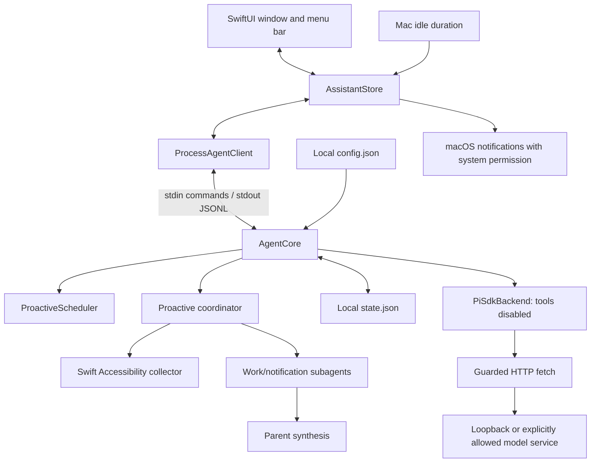

# Architecture

**English** | [简体中文](architecture.zh-CN.md)

Another You separates native presentation, proactive state, and model requests. This keeps user decisions visible and gives model access a narrow boundary. The current preview supports one local user and one active model request per sidecar.

## Data flow

[AgentClient.swift](../macos/AnotherYou/Sources/AnotherYouCore/AgentClient.swift) owns process launch, JSONL framing, decoding, and shutdown. [AssistantStore.swift](../macos/AnotherYou/Sources/AnotherYouCore/AssistantStore.swift) updates cards and activity from real events, correlates prompt responses, and supplies idle measurements. It does not treat a sent command as a completed action.

[AgentCore](../agent-core/src/index.ts) owns proposal transitions and persisted history. [ProactiveScheduler](../agent-core/src/scheduler.ts) matches time, event, and idle rules and applies cooldown/deduplication. [ProactiveCoordinator](../agent-core/src/proactive.ts) schedules separate work, notification, and synthesis tasks with spacing, fingerprints, deduplication, and backoff; it requests asynchronous collection only after the Swift host declares the sources. Subagents return structured facts, and the parent decides whether to emit one suggestion. [PiSdkBackend](../agent-core/src/pi-adapter.ts) gives background roles an empty tool list.

## Why suggestions do not require a model

Proactive participation comes from explainable rules and low-frequency background analysis. App launch, local time, or measured idle duration can create a pending suggestion; work-window and notification analysis only suggests after changed context is analyzed and the parent finds an actionable next step. It does not infer unseen calendars, contacts, or files.

A rule cannot create another suggestion while its previous proposal is pending, running, snoozed, or failed. Cooldowns and hashed deduplication keys further limit repetition. Snoozed suggestions keep their identity when they return. Pause and proposal state survive restarts; an interrupted generation returns as failed and needs a new user decision.

Choosing to generate a draft sends the proposal's title, summary, and explicit context to the model. Direct questions send the submitted prompt. Each request starts a new Pi session without automatic conversation memory. Completed text is for review: it does not send a message, modify a file, or execute a command.

The app and sidecar must be running for signals to be processed. Time rules match the current local minute; missed time slots are not replayed. Snoozed proposals are restored on the next eligible tick after their due time. See the [CLI reference](cli-reference.md) for states and rules.

## Runtime and data boundaries

| Boundary | Current implementation |
| --- | --- |
| Model network | `local` uses loopback only. Non-loopback requests require an authorized privacy mode, network opt-in, exact allowed hostname, and HTTPS. Each fetch rejects redirects and leaving the configured origin. |
| Model tools | Interactive sessions register file, shell, network, background-browser, and available native-computer tools; analysis roles use no tools. Pi project configuration, extensions, skills, and tool settings are not loaded. |
| Model credentials | The first valid local Pi discovery initializes an independent app snapshot of model settings and accounts; existing app values take precedence. Pi ModelRuntime resolves authentication and provider configuration. Swift only displays model status and keeps no model or key copy. |
| Persisted content | Storage switches and basic credential redaction apply when saving state. They do not filter live model input/output or encrypt files. |
| Proactive collection | `SystemContextCollector` asynchronously reads visible Accessibility text from the frontmost work window and Notification Center only when Accessibility is authorized, the session is unlocked, and the host has declared the source. It does not take screenshots, scan notification databases, or read files. |
| Native notifications | `AssistantStore` uses a separate UserDefaults preference and macOS authorization. The app must be bundled, inactive, and unpaused when a new suggestion arrives. `tools.notifications` is not this switch. |
| Process isolation | Swift and Node communicate through pipes; these processes are not an operating-system sandbox for untrusted code. |
| Development traffic | npm installs and Git source fetches operate separately from the model network policy. |

Configuration and state use local file permissions. Activity history is retained for 30 days by event time, without a record-count cap. The activity view combines 24h / 7d / 15d / 30d ranges with category filters and grouping, refreshing its time window every minute. Unresolved suggestions remain retained. Errors from malformed state are reported rather than silently resetting it. Exact defaults, file locations, retention, and the limits of redaction are in [configuration](configuration.md).

## Development and packaging

Source runs resolve an explicit Agent path or nearby development checkout. Default app bundles include the sidecar, official Node/npm, and a Chromium background browser. A resource marker makes complete apps use their bundled runtime and report missing files; only source runs and explicit `BUNDLE_NODE=0` development bundles fall back to the machine's Node/browser. Packaging checks public dependency versions, hashes, and licenses without copying developer settings, authentication, or personal browser profiles.

The npm SDK release and cached upstream source snapshot have separate locks. The cache is for review/customization and does not replace the SDK used by the running app. See [sources](sources.md) and [packaging](releasing.md).

## Remaining work

Calendar/Mail/Notes connectors, managed long-term memory, Keychain-backed remote credentials, external actions with approval/reversal, and launch at login are not implemented. Any such feature needs an explicit data flow, permission boundary, and corresponding validation before being described as available. Sparkle handles signed updates and installation after active tasks finish; development builds disable updates. Release tooling builds separate arm64 and x86_64 packages. See [releasing](releasing.md) for Developer ID, notarization, and actual publication status.
