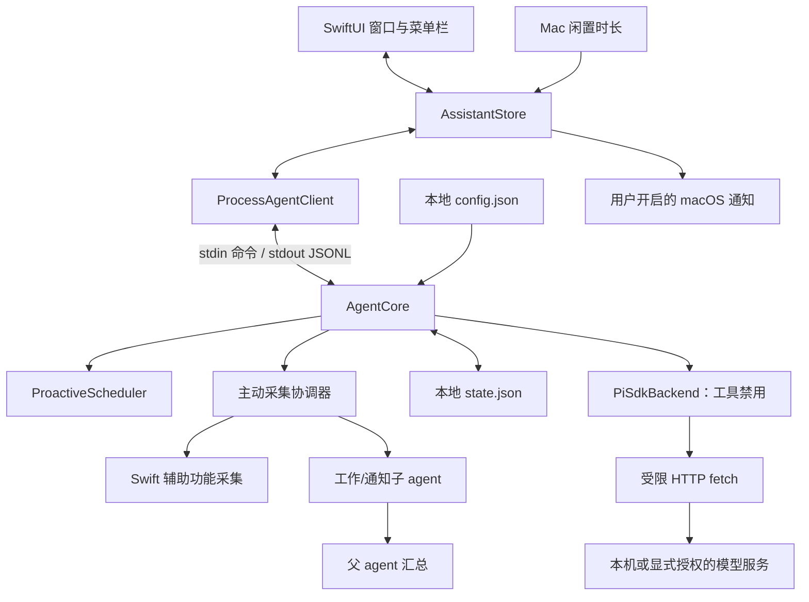

# 架构

[English](architecture.md) | **简体中文**

Another You 将原生展示、主动状态与模型请求分开，让用户决定可见，也让模型访问有明确边界。当前预览面向单个本机用户，每个 sidecar 同时处理一条模型请求。

## 数据流

[AgentClient.swift](../macos/AnotherYou/Sources/AnotherYouCore/AgentClient.swift) 负责进程启动、JSONL 分帧、解码与退出。[AssistantStore.swift](../macos/AnotherYou/Sources/AnotherYouCore/AssistantStore.swift) 根据真实事件更新卡片和活动，关联提问响应，并提供闲置测量；不会把发送命令视为执行完成。

[AgentCore](../agent-core/src/index.ts) 管理建议状态流转和历史持久化。[ProactiveScheduler](../agent-core/src/scheduler.ts) 匹配时间、事件和闲置规则，执行冷却与去重。[ProactiveCoordinator](../agent-core/src/proactive.ts) 为工作窗口、通知和父 agent 汇总分别计时、错峰、去重并退避；它只在 Swift 宿主声明来源后发起异步采集。子 agent 只返回结构化事实，父 agent 决定是否发出一条建议。[PiSdkBackend](../agent-core/src/pi-adapter.ts) 对后台角色使用空工具列表。

## 为什么建议不依赖模型

当前主动参与来自可解释的规则和低频后台分析。应用启动、本地时间匹配或真实闲置达到阈值，可以产生待处理建议；工作窗口和通知采集只有在内容变化经过子 agent 分析、父 agent 判断确有下一步时才会建议。系统不推断未读取的日历、联系人或文件内容。

同一规则上次的建议处于待处理、执行中、稍后或失败状态时，不再生成新建议。冷却和保存为摘要的去重键进一步限制重复。稍后恢复的建议保留原身份。暂停与建议状态跨重启保存；中断的生成恢复为失败，需要用户重新决定。

用户选择生成草稿后，才会把建议标题、说明和显式上下文发送给模型。直接提问只发送该次提交的提示词。每次请求创建新的 Pi 会话，不会自动携带聊天记忆。生成文本供用户审阅，不会发送消息、修改文件或执行命令。

应用与 sidecar 必须运行才能处理信号。时间规则只匹配当前本地分钟，不补发错过的时段；稍后建议会在到期后的下一次可处理 tick 恢复。状态和规则详见 [CLI 参考](cli-reference.zh-CN.md)。

## 运行时与数据边界

| 边界 | 当前实现 |
| --- | --- |
| 模型网络 | `local` 只连接回环地址。非回环请求需要允许的隐私模式、显式网络授权、精确允许主机和 HTTPS；每次 fetch 拒绝重定向或离开配置来源。 |
| 模型工具 | 交互会话注册文件、Shell、网络、后台浏览器及可用时的原生电脑工具；分析角色使用空工具列表。不加载用户 Pi 配置、扩展、技能或默认提供方凭据。 |
| 模型凭据 | 由 Pi ModelRuntime 读取 Pi 认证和提供方配置，Swift 只显示模型状态，不维护密钥或模型副本。 |
| 持久化内容 | 状态保存时应用内容开关和基础凭据遮盖；它们不过滤实时模型输入/输出，也不加密文件。 |
| 主动采集 | `SystemContextCollector` 在辅助功能授权、会话解锁且宿主声明来源时异步读取前台工作窗口及 Notification Center 可见文本；不截图、不读通知数据库、不读磁盘文件。 |
| 原生通知 | `AssistantStore` 使用独立 UserDefaults 偏好和 macOS 授权；新建议到达时应用须为应用包、非活跃且未暂停。`tools.notifications` 不是这个开关。 |
| 进程隔离 | Swift 与 Node 通过管道通信；这些进程不是隔离不可信代码的操作系统沙箱。 |
| 开发网络 | npm 安装与 Git 源码拉取独立于模型网络策略。 |

配置与状态使用本机文件权限。历史有数量上限，未解决的建议则继续保留。损坏状态会明确报错，不会静默重置。默认值、文件位置、保留数量和遮盖限制见 [配置参考](configuration.zh-CN.md)。

## 开发与打包

源码运行时查找显式 Agent 路径或附近开发目录；默认应用包包含 sidecar、官方 Node/npm 与 Chromium 后台浏览器。完整应用通过资源标记固定使用包内运行文件，损坏时报告错误；只有源码或显式 `BUNDLE_NODE=0` 开发包才回退到本机 Node/浏览器。打包不复制开发者配置、认证或个人浏览器资料，官方依赖版本、摘要与许可证随打包流程核对。

npm SDK 发布版和上游源码缓存分别锁定。缓存用于阅读和定制，不会替代应用运行时所用 SDK。详见 [来源](sources.zh-CN.md) 与 [打包说明](releasing.zh-CN.md)。

## 尚未实现

Calendar/Mail/Notes 连接器、受管理的长期记忆、基于 Keychain 的远程凭据、带审批/撤销的外部动作、登录时启动尚未实现。添加这些能力前，需要明确数据流、权限边界和对应验证，再写入可用功能。自动更新由 Sparkle 处理，经签名校验后在任务完成时安装；开发包禁用。发布工具分别构建 arm64 和 x86_64 包，Developer ID、公证与真实发布状态见[发布指南](releasing.zh-CN.md)。
