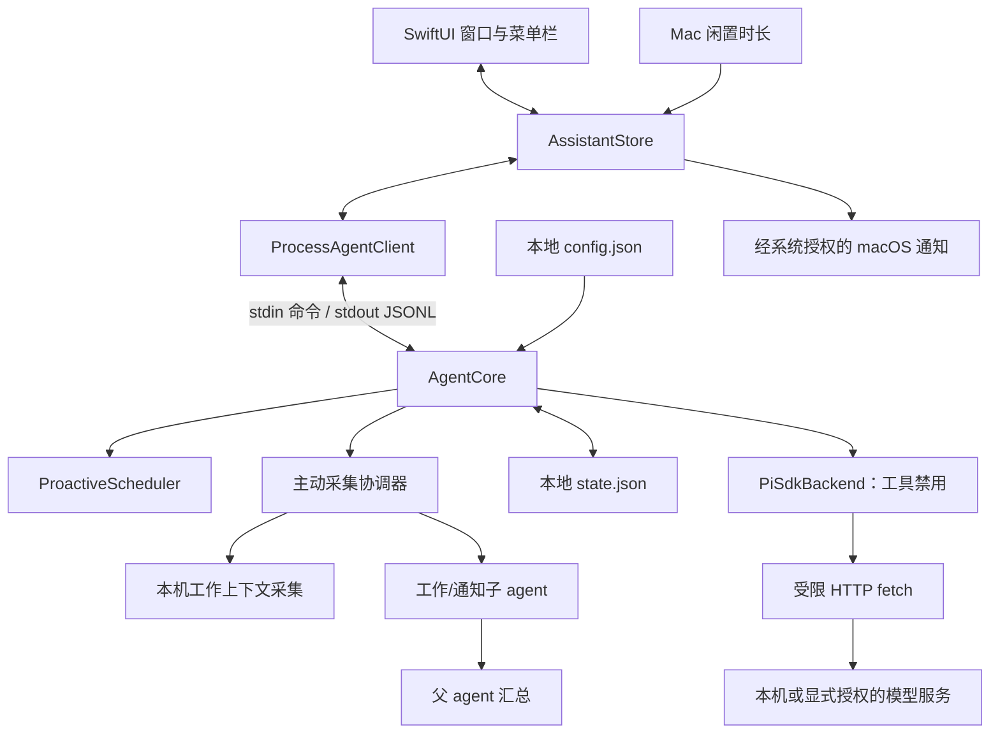

# 架构

[English](architecture.md) | **简体中文**

Another You 将原生展示、主动状态与模型请求分开，让用户决定可见，也让模型访问有明确边界。当前预览面向单个本机用户，每个 sidecar 同时处理一条模型请求。

## 数据流

[AgentClient.swift](../macos/AnotherYou/Sources/AnotherYouCore/AgentClient.swift) 负责进程启动、JSONL 分帧、解码与退出。[AssistantStore.swift](../macos/AnotherYou/Sources/AnotherYouCore/AssistantStore.swift) 根据真实事件更新卡片和活动，关联提问响应，并提供闲置测量；不会把发送命令视为执行完成。

[AgentCore](../agent-core/src/index.ts) 管理建议状态流转和历史持久化。[ProactiveScheduler](../agent-core/src/scheduler.ts) 匹配时间、事件和闲置规则，执行冷却与去重。[ProactiveCoordinator](../agent-core/src/proactive.ts) 为工作窗口、通知和父 agent 汇总分别计时、错峰、去重并退避；它只在 Swift 宿主声明来源后发起异步采集。工作分析和汇总优先使用独立的 [LocalModelBackend](../agent-core/src/local-model.ts) 连接 Ollama 或 LM Studio。发现待办后及时汇总；本地能完成的草稿直接进入会话，只有有事实依据且明确需要更强能力时才通过内置 `remote_assist` 调用 Pi。[PiSdkBackend](../agent-core/src/pi-adapter.ts) 对后台角色使用空工具列表。

## 规则与本地主动判断

当前主动参与来自可解释的规则和低频后台分析。应用启动、本地时间匹配或真实闲置达到阈值，可以产生待处理建议；工作窗口和通知采集只有在内容变化经过子 agent 分析、父 agent 判断确有下一步时才会建议。系统不推断未读取的日历、联系人或文件内容。

同一规则上次的建议处于待处理、执行中、稍后或失败状态时，不再生成新建议。冷却和保存为摘要的去重键进一步限制重复。稍后恢复的建议保留原身份。暂停与建议状态跨重启保存；中断的生成恢复为失败，需要用户重新决定。

始终自动生成具体草稿并保存为可继续的会话。本地建议的草稿继续使用本地模型。手动对话使用模型页的 Pi 配置与现有工具，并携带当前会话的有限历史。后台分析不提供执行工具，只生成可审阅的文本；未配置本地服务时不会自动调用远端。

应用与 sidecar 必须运行才能处理信号。时间规则只匹配当前本地分钟，不补发错过的时段；稍后建议会在到期后的下一次可处理 tick 恢复。状态和规则详见 [CLI 参考](cli-reference.zh-CN.md)。

## 运行时与数据边界

| 边界 | 当前实现 |
| --- | --- |
| 模型网络 | 本地主动助手只连接本机或私有局域网 IP；远端协助使用用户保存的 Pi 提供方配置。两种调用都拒绝 HTTP 重定向。 |
| 模型工具 | 交互会话注册文件、Shell、网络、后台浏览器及可用时的原生电脑工具；分析角色使用空工具列表。不加载 Pi 项目配置、扩展、技能或工具设置。 |
| 模型凭据 | 首次发现有效本机 Pi 配置时初始化独立的应用模型和账户快照，应用已有值优先。本地 SQLite 保存各账户的配置、凭据和目录缓存，Pi 通过存储适配器使用所选账户。Swift 仅在点击眼睛时短暂持有已保存密钥，不写入状态或历史。 |
| 持久化内容 | 状态保存时应用内容开关和基础凭据遮盖；它们不过滤实时模型输入/输出，也不加密文件。 |
| 主动采集 | `SystemContextCollector` 在会话解锁时读取运行应用的多个可访问窗口、当前用户进程及工作目录、关联项目和打开文件、所选时间内的本机文档与浏览记录；通知仍来自 Notification Center 可访问文本。窗口与通知需要辅助功能权限；文件和历史遵守系统访问权限，不截图、不读取通知数据库或进程内存。 |
| 原生通知 | `AssistantStore` 使用独立 UserDefaults 偏好和 macOS 授权；新建议到达时应用须为应用包、非活跃且未暂停。`tools.notifications` 不是这个开关。 |
| 进程隔离 | Swift 与 Node 通过管道通信；这些进程不是隔离不可信代码的操作系统沙箱。 |
| 开发网络 | npm 安装与 Git 源码拉取独立于模型网络策略。 |

配置与状态使用本机文件权限。活动历史按事件时间保留最近 30 天，不按条数截断。活动页支持将 24h / 7d / 15d / 30d 时间范围与类型筛选、分组组合使用，时间窗口每分钟刷新。未解决的建议继续保留。损坏状态会明确报错，不会静默重置。默认值、文件位置、保留期限和遮盖限制见 [配置参考](configuration.zh-CN.md)。

## 开发与打包

源码运行时查找显式 Agent 路径或附近开发目录；默认应用包包含 sidecar、官方 Node/npm 与 Chromium 后台浏览器。完整应用通过资源标记固定使用包内运行文件，损坏时报告错误；只有源码或显式 `BUNDLE_NODE=0` 开发包才回退到本机 Node/浏览器。打包不复制开发者配置、认证或个人浏览器资料，官方依赖版本、摘要与许可证随打包流程核对。

npm SDK 发布版和上游源码缓存分别锁定。缓存用于阅读和定制，不会替代应用运行时所用 SDK。详见 [来源](sources.zh-CN.md) 与 [打包说明](releasing.zh-CN.md)。

## 尚未实现

Calendar/Mail/Notes 连接器、受管理的长期记忆、基于 Keychain 的远程凭据、带审批/撤销的外部动作、登录时启动尚未实现。添加这些能力前，需要明确数据流、权限边界和对应验证，再写入可用功能。自动更新由 Sparkle 处理，经签名校验后在任务完成时安装；开发包禁用。发布工具分别构建 arm64 和 x86_64 包，Developer ID、公证与真实发布状态见[发布指南](releasing.zh-CN.md)。
